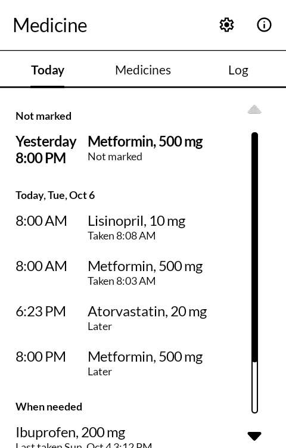
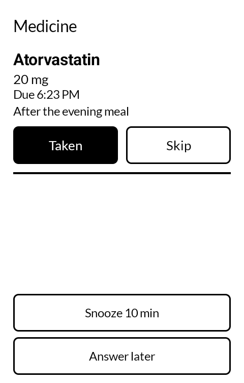
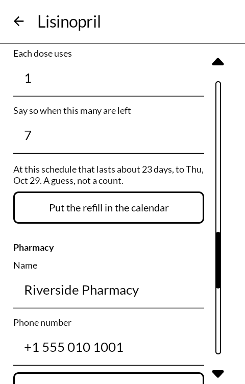
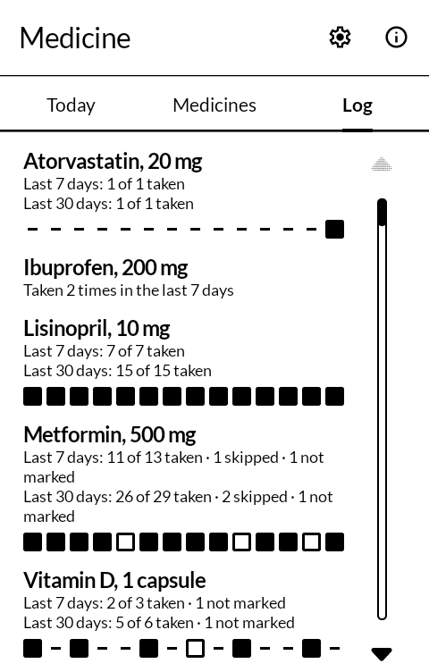

# 服薬 fukuyaku — Medicine

Reminders for medicines, and a log of what was taken. Set up each medicine with the times it
is taken; at each one a reminder rings with **Taken**, **Skip** and **Snooze** on it, and those
work from the lock screen without unlocking. Built for the
[Mudita Kompakt](https://mudita.com/products/kompakt/), and it will install on any Android 12
device.

*Fukuyaku* is 服薬 — taking medicine, the plain word on a pharmacy's instructions.

Written from scratch in Kotlin and Jetpack Compose, using Mudita's own
[MMD](https://github.com/mudita/MMD) design system so it looks like the apps the phone already
ships with.

| | |
|---|---|
|  |  |
|  |  |

## What it does

- **Rings at the time a dose is due**, as an alarm clock does, and gets through Do Not
  Disturb wherever alarms are let through. With the screen off the reminder fills the screen
  over the lock screen, in large type, with the medicine's notes under it.
- **At set times** on every day, on some days of the week, or every few days; **every few
  hours** from a first dose; or **only when needed**, written down with one press when it is
  taken.
- **Rings again** if a dose is not marked: after 30 minutes, up to three times, unless the next
  dose is due first. Both can be changed, or switched off.
- **Never loses a dose quietly.** Every dose that comes due goes into the log, marked or not.
  If the phone was off or the app was stopped when a dose was due, the log says the reminder
  did not ring, and the first screen says when the app was stopped.
- **Counts what is left**, if you want it to, and says once when it gets low. From there the
  pharmacy is a press away: **Call** or **Text** it, chosen from Contacts or typed in, and the
  refill can go into the calendar with **Put the refill in the calendar**. Each medicine can
  name its doctor the same way, to call or text about it.
- **The log** shows each medicine's last 7 and 30 days and a strip of the last fortnight, then
  every dose by day. A dose marked late can be marked as taken at its time or just now. It can
  be shared as text, into a note or a message, or saved as a CSV file; both name each
  medicine's doctor, when it has one.
- **Try a reminder**, in Settings, rings one in a minute through the same alarm a dose uses, to
  see how it looks and sounds on your phone.

## One step on a Kompakt

The Kompakt's DuraSpeed setting shuts down apps a few minutes after the screen goes dark, and
an app shut down that way has its alarms cancelled: no reminder rings until the app is opened
again. On a Kompakt, Medicine's first screen says so and has a button to **Open DuraSpeed**;
tap **Open** there and switch Medicine on in the list, then press **It's switched on**. If
DuraSpeed stops the app again later, the step comes back.

## What it does not do

- **It does not advise.** It reminds you of what you set up, and keeps a record. What to take,
  how much and when is for a doctor or a pharmacist to say.
- **Nothing leaves the phone.** The app has no internet permission. See [PRIVACY.md](PRIVACY.md).
- **The phone's alarm icon shows the next reminder**, as it does for an alarm clock: that is the
  kind of alarm that rings on time whatever the phone is saving power for.
- **After the phone restarts**, reminders start again once the phone is unlocked; anything due
  before then is in the log, and the newest one rings.
- **Times are clock times**, in whichever time zone the phone is in: 08:00 stays 08:00 across a
  clock change and after a flight. "Every 8 hours" is counted on the clock too, so on the night
  the clocks change one gap is an hour longer or shorter.

## With the other apps

- **Glance** ([hitome](https://github.com/wanderwildwood/hitome)) can show the next dose, and
  any dose not marked, on the lock screen. It is off until **Settings → Next dose on the lock
  screen** is turned on, because it names medicines to anyone who picks up the phone.
- **Calendar** ([koyomi](https://github.com/wanderwildwood/koyomi)), or any calendar app,
  opens with the refill filled in.
- **Contacts** ([enishi](https://github.com/wanderwildwood/enishi)), or the phone's own, is
  where the pharmacy and the doctor are chosen from, and **Open in Contacts** goes back to them.
- **Notes**, **Email** and **Messaging** take the log through **Share as text**; **Files**
  ([tana](https://github.com/wanderwildwood/tana)) is one place to save the CSV.

## For other apps

Another app can ask for the list of medicines being taken, and gets it only after you see the
list on Medicine's own screen and press **Share**. Field Kit uses it to fill the medicines on
its emergency card. Only names, amounts, when they are taken and the doctor's name go across;
not the log, what is left, the pharmacy, or the doctor's number.

- Start for a result: action `com.wanderwildwood.fukuyaku.action.SHARE_MEDICINES`, with
  `setPackage("com.wanderwildwood.fukuyaku")`.
- On Share: `RESULT_OK`, with `Intent.EXTRA_TEXT` holding plain text, one medicine per line,
  e.g. `Lisinopril 10 mg, every day at 8:00 AM (Dr Ada Whitlock)`; the brackets only when the
  medicine has a doctor. Paused medicines are left out.
- On Don't share, Back, or when there are no medicines: `RESULT_CANCELED`.
- An app targeting Android 11 or later also needs
  `<queries><package android:name="com.wanderwildwood.fukuyaku" /></queries>`.

Another app can also offer a pharmacy. Contacts does it from a person's More page ("Set as
pharmacy in Medicine"). Medicine shows the name and number with every medicine ticked; you
untick any that use a different pharmacy and press **Set pharmacy**. Each ticked medicine then
has it, as if chosen from Contacts on its own page.

- Start: action `com.wanderwildwood.fukuyaku.action.SET_PHARMACY`, with
  `setPackage("com.wanderwildwood.fukuyaku")` and string extras
  `com.wanderwildwood.fukuyaku.extra.NAME`, `com.wanderwildwood.fukuyaku.extra.NUMBER`
  (needed) and, optionally, `com.wanderwildwood.fukuyaku.extra.CONTACT`, the contact's
  lookup URI for "Open in Contacts".
- On Set pharmacy: `RESULT_OK`. Otherwise `RESULT_CANCELED`.

A doctor comes the same way ("Set as doctor in Medicine"): action
`com.wanderwildwood.fukuyaku.action.SET_DOCTOR`, the same three extras, and **Set doctor**.

## Building

```
./gradlew assembleDebug
```

A release build needs a keystore at `signing/signing.keystore` with a matching
`signing/signing.properties`. There is no fallback key in this repository: without one, a
release build comes out unsigned rather than wrongly signed.

## Getting it, and keeping it

Download <https://github.com/wanderwildwood/fukuyaku/releases/latest/download/fukuyaku.apk>
and sideload it. That address always points at the newest release, and every release publishes
a `.sha256` beside the APK if you would rather check than trust.

For updates without doing this by hand, add this repository to
[Obtainium](https://github.com/ImranR98/Obtainium):

    https://github.com/wanderwildwood/fukuyaku

## Licence

GPL-3.0-only. See [LICENSE](LICENSE).

Copyright (C) 2026 wander wildwood

This program is free software: you can redistribute it and/or modify it under the terms of the
GNU General Public License as published by the Free Software Foundation, version 3.

This program is distributed in the hope that it will be useful, but WITHOUT ANY WARRANTY;
without even the implied warranty of MERCHANTABILITY or FITNESS FOR A PARTICULAR PURPOSE. See
the GNU General Public License for more details.

You should have received a copy of the GNU General Public License along with this program. If
not, see <https://www.gnu.org/licenses/>.

A medicine reminder holds some of the most private things about a person, and the licence is
copyleft so that nobody can ship this code with something added that sends them anywhere,
without publishing what they added. Icons are from Material Symbols, Apache 2.0.
